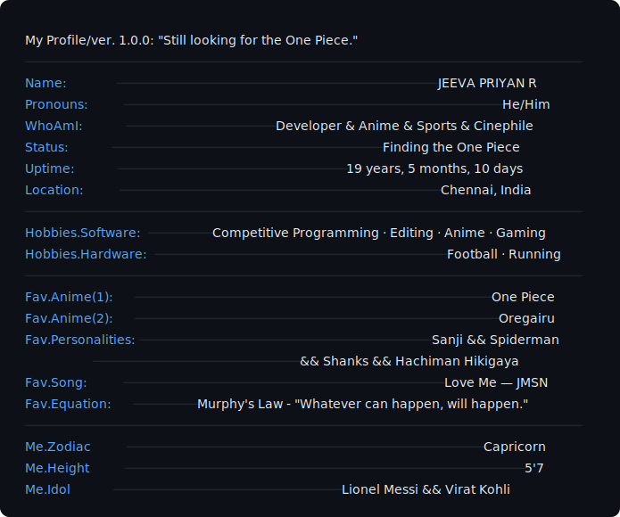
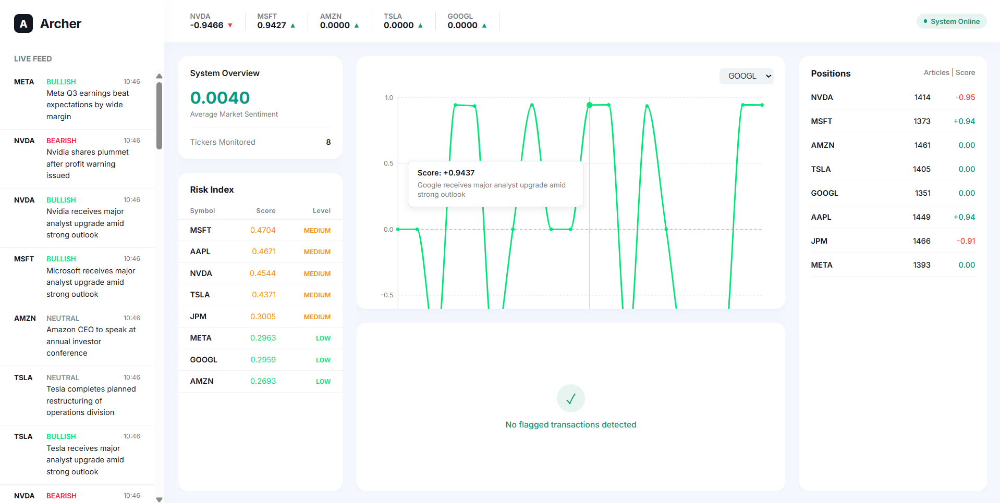
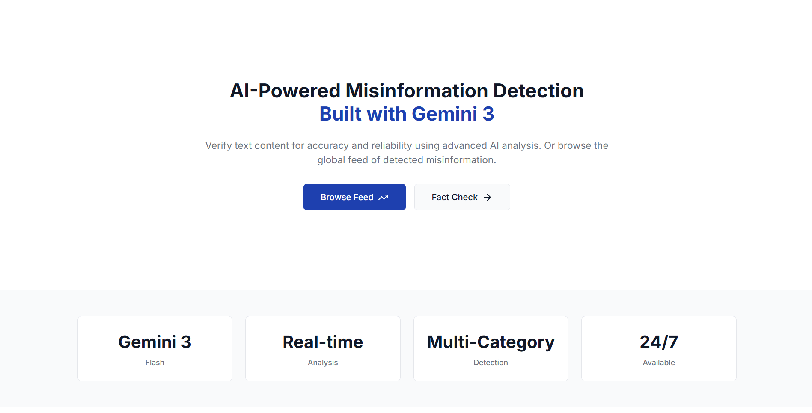
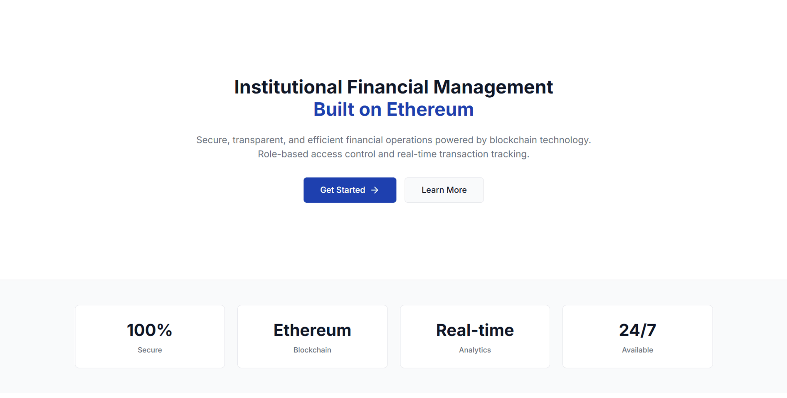
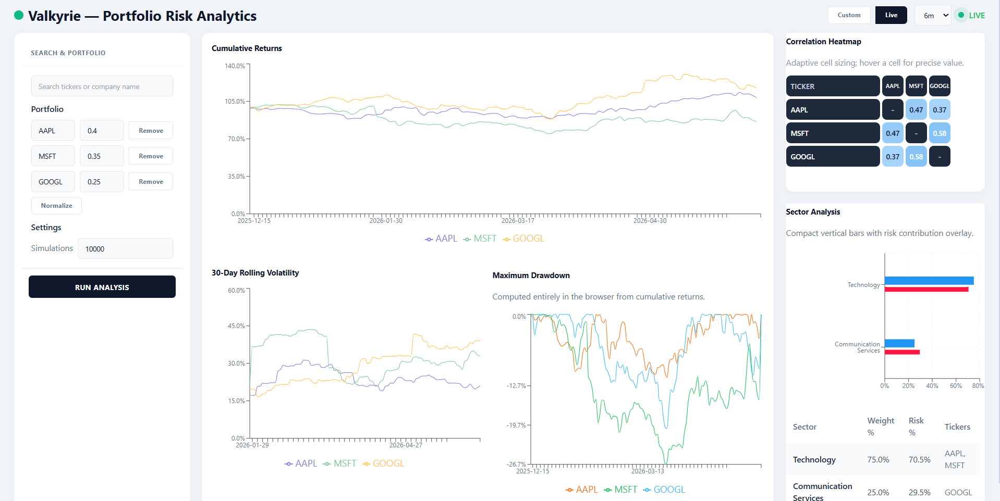

<div align="center">
  
</div>
<br>
<div align="center">
  
### ✦ About me - Technical ✦

</div>
<div align="center">

</div>
<div align="center">

### ✦ About me - Physical ✦

</div>

<table width="100%">
<tr>
<td colspan="2" style="padding:0">

```
jeevapriyan@dev: ~/my_readme (main ⚡)$ neofetch --personal
```

</td>
</tr>
<tr>
<td valign="top" width="60%">

</td>
<td valign="middle" width="40%" align="center">

<!-- 
  Replace the src below with any anime GIF/image URL you like.
  Good sources: giphy.com, tenor.com, imgur.com
  Recommended size: width="320" looks best on GitHub
-->

</td>
</tr>
</table>
<!--
```
My Profile/ver. 1.0.0: "Still looking for the One Piece."
─────────────────────────────────────────────────────────────────────
Name:              JEEVA PRIYAN R ───────────────────────────────────
Pronouns:          He/Him ♂ ─────────────────────────────────────────
WhoAmI:            Developer </> Anime ☯︎ & Sports ⚽︎ & Cinephile 📽 ─
Status:            Finding the One Piece ☠︎︎ ──────────────────────────
Uptime:            19 years old ⏱ ───────────────────────────────────
Location:          Chennai, India 🇮🇳 ⟟ ───────────────────────────────
──────────────────────────────────────────────────────────────────────
Hobbies.Software:  Competitive Programming · Editing · Anime  · Gaming
Hobbies.Hardware:  Football  · Running ───────────────────────────────
──────────────────────────────────────────────────────────────────────
Fav.Anime(1):      One Piece ☠︎︎ ──────────────────────────────────────
Fav.Anime(2):      Oregairu 🂡 ────────────────────────────────────────
Fav.Personalities: Sanji ☠︎︎ && Spiderman 🕷 ──────────────────────────
                   && Shanks ☠︎︎ && Hachiman Hikigaya 🂡 ───────────────
Fav.Song:          Love Me — JMSN ❤︎ ─────────────────────────────────
Fav.Equation:      Murphy's Law - "Whatever can happen, will happen."
──────────────────────────────────────────────────────────────────────
Me.Zodiac          Capcricorn ♑︎ ─────────────────────────────────────
Me.Height          5'7 ───────────────────────────────────────────────
Me.Idol            Lionel Messi && Virat Kholi ───────────────────────
```
-->
<div align="center">

### ✦ My Stats ✦

<br>
</div>
<br>
<div align="center">


</div>
<div align="center">

### ✦ Projects ✦

</div>
<table>
  <tr>
    <td>
      <a href="https://github.com/jeevapriyan10/archer"></a>
    </td>
    <td>
      <a href="https://github.com/jeevapriyan10/GrandWarden"></a>
    </td>
  </tr>
    <tr>
    <td>
      <a href="https://github.com/jeevapriyan10/LedgerKnight"></a>
    </td>
    <td>
      <a href="https://github.com/jeevapriyan10/valkyrie"></a>
    </td>
  </tr>
</table>
<div align="center" width="100">

### ✦ GitHub Stats ✦
<br>


</div>
<div align="center">
  
### ✦ Shoot the Commits ✦


</div>

<div align="center">
  
  ### ✦ Contact Me ✦


[](https://instagram.com/ft.jeevz_)
[](mailto:jeeva.mail10@gmail.com)
[](https://t.me/jeevapriyan10)
</div>
